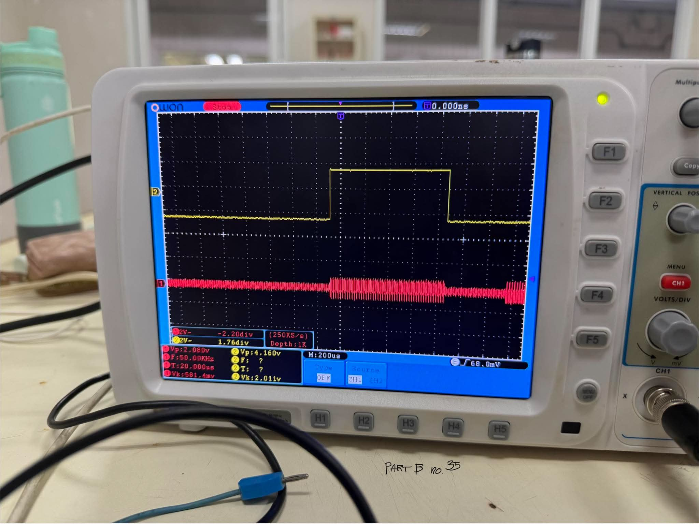
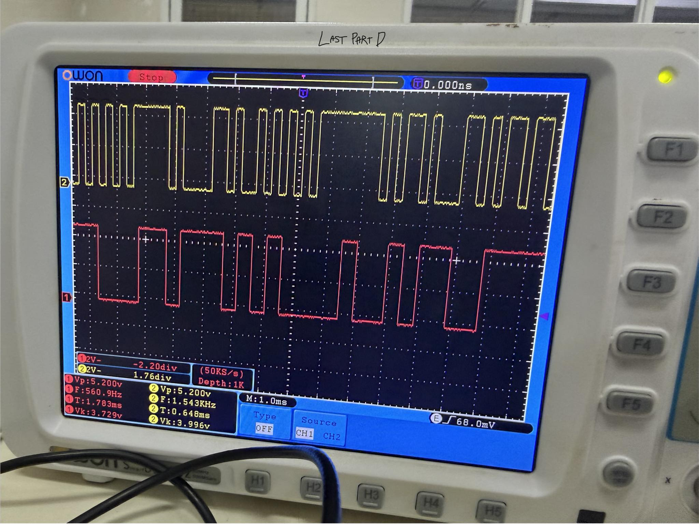

## Laboratory Experiment: Full Demodulation of a QPSK Signal

This laboratory experiment demonstrates the full demodulation process of a Quadrature Phase Shift Keying (QPSK) signal, a digital modulation technique used to transmit data by varying the phase of a carrier signal.

---

### QPSK Demodulation Characteristics
- QPSK transmits digital data using four distinct phase states of a carrier signal.
- Each symbol represents 2 bits of information.
- The received signal is separated into in-phase (I) and quadrature (Q) components.
- Coherent detection is used to align the received signal with a reference carrier.
- The I and Q components are processed to recover the original binary data.

---

### Circuit Diagram

  
Experiment QPSK Diagram

**Generating a QPSK Signal**

**Full Diagram: Modulator, channel, and demodulator**

---

### Oscilloscope Display

  
Experiment QPSK Result

**Part B Result: Generating a QPSK Signal**

**Part D Result: Demodulation of a QPSK**

- Received QPSK signal waveform  
- I and Q component outputs after mixing and filtering  
- Recovered digital bitstream  

---

### Observation
The experiment demonstrated how a QPSK signal can be successfully demodulated by separating it into its I and Q components. After coherent detection, mixing, and low-pass filtering, the signals were analyzed using a constellation diagram to identify the transmitted symbols. Each symbol was correctly mapped back into binary data, showing how phase variations encode information. The experiment also highlighted the importance of carrier synchronization, as phase errors and noise can affect accurate data recovery.
